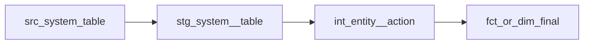

# {Feature Name} — Technical Design

> **Generado por:** dbt-architect | **Fecha:** {date} | **Estado:** Pendiente de aprobación

## 1. DAG (Directed Acyclic Graph)



## 2. Modelos

### stg_{source}__{entity}
- **Capa:** Staging
- **Materialización:** view
- **Grain:** Un registro por {grain}
- **Source:** `{{ source('{source_name}', '{table_name}') }}`
- **Transformaciones:**
  - Renombrar columnas a snake_case
  - Castear tipos
  - Filtrar registros eliminados (soft delete)

### int_{entity}__{action}
- **Capa:** Intermediate
- **Materialización:** ephemeral | table
- **Grain:** Un registro por {grain}
- **Lógica de negocio:**
  - {descripción}

### fct_{entity} | dim_{entity}
- **Capa:** Marts
- **Materialización:** table | incremental
- **Grain:** Un registro por {grain}
- **Estrategia incremental:** {merge | delete+insert | append}
- **unique_key:** {columns}

## 3. Contratos de Modelo (Model Contracts)

### fct_{entity}
```yaml
models:
  - name: fct_{entity}
    config:
      contract:
        enforced: true
    columns:
      - name: {pk_column}
        data_type: string
        constraints:
          - type: not_null
          - type: unique
```

## 4. Source Contracts

Source database/schema use dbt vars (values from `project-config.yaml → sources`):

```yaml
sources:
  - name: {source_name}
    database: "{{ var('source_database') }}"
    schema: "{{ var('source_schema_prefix') }}_{source_name}"
    tables:
      - name: {table}
        loaded_at_field: {timestamp_column}
        freshness:
          warn_after: {count: 12, period: hour}
          error_after: {count: 24, period: hour}
```

**dbt_project.yml vars:**
```yaml
vars:
  source_database: "{value}"
  source_schema_prefix: "{value}"
```

**Estrategia para sources no disponibles:**
| Source | Existe | Estrategia |
|--------|--------|------------|
| {source_name}.{table} | sí / no | real / seeds / demo scripts |

## 5. Estrategia de Materialización

| Modelo | Materialización | Justificación |
|--------|----------------|---------------|
| stg_*  | view           | Siempre datos frescos, bajo costo |
| int_*  | ephemeral      | No necesita persistencia |
| fct_*  | incremental    | Tabla grande, append-only |
| dim_*  | table          | Tabla pequeña, full refresh |

## 5b. dbt Mesh Architecture (incluir solo si aplica)

> Omitir esta sección si el diseño es single-project.

### Decisión: {Single-project | Monorepo multi-proyecto}
**Justificación:** {razón basada en signals del requirements.md}

## 6. Estrategia de Testing

| Tipo | Modelos | Tests |
|------|---------|-------|
| Generic | Todos | not_null, unique en PKs |
| Relationships | fct_* | FK a dimensiones |
| Accepted values | dim_* | Enums conocidos |
| Unit tests | int_*, fct_* | Lógica de negocio compleja |

## 7. Consideraciones

- {rendimiento, dependencias, migración, etc.}
