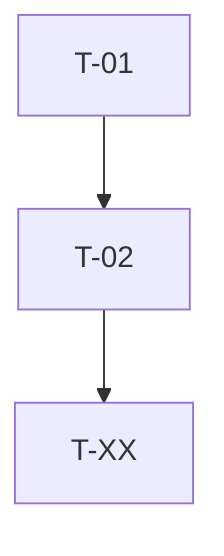

# {Feature Name} — Task Breakdown

> **Generado por:** dbt-planner | **Fecha:** {date} | **Estado:** Pendiente de aprobación

## Resumen

- Total tareas: {N}
- Tareas paralelas (sin dependencias entre sí): {N}

## Grupos de Ejecución

### Grupo 1: Sources & Staging (paralelo)
Agente: `dbt-developer`

| ID | Tarea | Archivos | Dependencias | Verificación |
|----|-------|----------|-------------|-------------|
| T-01 | Crear source YAML para {source} | `models/staging/{source}/__{source}__sources.yml` | ninguna | `dbt compile -s source:{source_name}` |
| T-02 | Crear stg_{source}__{entity} | `models/staging/{source}/stg_{source}__{entity}.sql`, `...yml` | T-01 | `dbt build -s stg_{source}__{entity}` |

### Grupo 2: Intermediate (secuencial si hay dependencias)
Agente: `dbt-developer`

| ID | Tarea | Archivos | Dependencias | Verificación |
|----|-------|----------|-------------|-------------|
| T-XX | Crear int_{entity}__{action} | `models/intermediate/int_{entity}__{action}.sql`, `...yml` | T-02 | `dbt build -s int_{entity}__{action}` |

### Grupo 3: Marts
Agente: `dbt-developer`

| ID | Tarea | Archivos | Dependencias | Verificación |
|----|-------|----------|-------------|-------------|
| T-XX | Crear fct/dim_{entity} con contrato | `models/marts/{domain}/fct_{entity}.sql`, `...yml` | T-XX | `dbt build -s fct_{entity}` |

### Grupo 4: Tests (paralelo con Grupo 3 si no hay dependencias)
Agente: `dbt-tester`

| ID | Tarea | Archivos | Dependencias | Verificación |
|----|-------|----------|-------------|-------------|
| T-XX | accepted_values para {model} | YAML en `models/marts/` | T-XX | `dbt test -s {model}` |
| T-XX | Unit tests para lógica de negocio | `tests/unit/unit_{entity}.yml` | T-XX | `dbt test -s test_type:unit` |

### Grupo 5: Semantic Layer (si aplica)
Agente: `dbt-semantic`

| ID | Tarea | Archivos | Dependencias | Verificación |
|----|-------|----------|-------------|-------------|
| T-XX | Semantic model + metrics | `models/marts/{domain}/__{domain}__semantic.yml` | T-XX | `dbt parse` |

## Grafo de Dependencias

